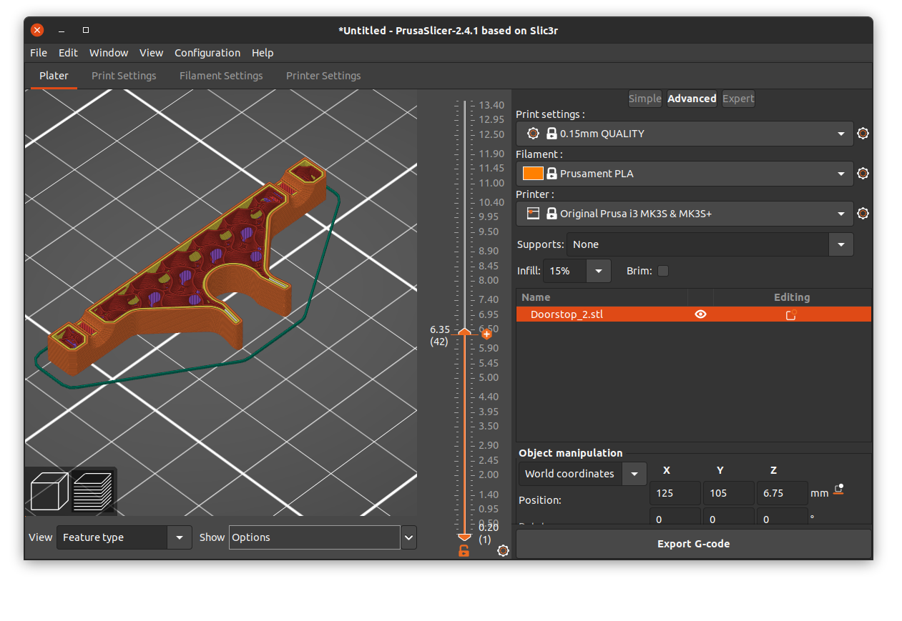
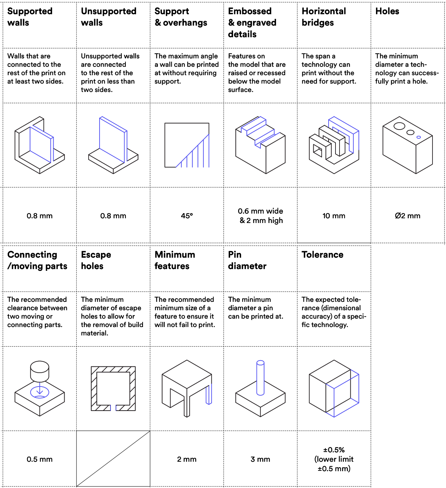

# How to use the 3D printer
3D printing is relatively easy and consists of three steps.

1. Creating a 3D model
2. Slicing the model 
3. Printing it

The printer we have is a Prusa i3 MK3S+ and it is a type of FDM (fused deposition modeling) printer. One can thing of it as a glue gun stuck to a Cartesian gantry which replicates a 3D model by printing it layer by layer. 

Below are the aforementioned steps in a bit more detail. 

**Note:** 3D printing is an iterative process, so don't expect your first print to be a complete success.

## TL;DR

1. Model what you need in Autodesk Fusion 360
2. Export it as a mesh (.3mf file format)
3. Open it with PrusaSlicer
4. Slice it with the approriate material and layer height.
   * Most likely PLA plastic and 0.2 mm layer height. 
5. Export the G-code to an SD-card and print it! 
6. **Make sure to observe the first two layers being printed**

**Note:** Most 3D prints fail early in the printing process due to poor bed adhesion. A failed print can result in the infamous "blob of death" and would lead to several days of downtime. 

# Modeling 
In order to print something, the first step is to get a 3D model. 

**Option 1:** Find pre-existing models that other people have created at websites like:

* [thingiverse.com](https://thingiverse.com/)
* [cults3d.com](https://cults3d.com/)

If you need models of common mechanical components, e.g. bolts, brackets, etc., then you can use McMaster-Carr ([mcmaster.com](mcmaster.com)). They provide 3D files for most of the components they sell. 

**Option 2:** Model it yourself. There are many options when it comes to 3D modeling, but I'd recommend the following: 

* [Fusion 360](https://www.autodesk.com/products/fusion-360/overview) (autodesk.com/products/fusion-360/)
* [Tinkercad](https://www.tinkercad.com/) (tinkercad.com)

If your design contain a lot of organic shapes, the 3D software Blender is a good software.

I will not go into any detail about actually use these software, and instead I direct you to look up some introduction video on YouTube. There are however some guidelines that should be followed when designing your model for 3D printing. They are listed in the [Guidelines](#guidelines) section.

# Slicing 
A 3D printer works by printing one layer at a time to slowly build up to a physical representation of you 3D model. Therefore we need to convert the model into said layer - or slices. This process is known as slicing, and converts a 3D model into a long list of instructions for the printer to execute in order to replicate the model. The format of these instructions are known as G-code and is used by almost all CNC machines in the world (e.g. mills, lathes, laser cutters, etc.). 

There are many different slicing software and they are essentially printer agnostic. Some might have more functionality than others but typically achieve the same thing. I recommend PrusaSlicer (which is made by the same company as the printer), simply because it comes with built-in profiles for this particular printer which increases the likelihood of getting a successful print. PrusaSlicer is also open source. 

You can download PrusaSlicer from Prusas website: [prusa3d.com](https://www.prusa3d.com/en/)

## Using PrusaSlicer 
The slicer software is very intuitive and below you can see a screenshot of a 3D model that has been sliced. For simple prints, you typically only need to consider the settings visible on the top right quadrant.

### Print settings (Layer height)
The layer height determines the z-axis resolution. Having a smaller layer height gives a prettier print at the cost of printing time. Generally, I'd suggest starting with 0.2 mm, or even 0.3 mm if the part is big with very basic details. Start big and go smaller only if you need to.

Like I mentioned in the beginning: 3D printing is an iterative process, and you will probably need to tweak this. 

### Filament
Most of the times, PLA (polylactic acid) is what you will use. If you are expecting high temperature (>70 °C) or require very strong parts, you need to look elsewhere. Google is your friend. 

### Infill 
Infill refers to how much of the inside of the part will be filled with plastic. The default is 15%, meaning that the inside is 85% air. When printing with PLA, this is surprisingly strong and probably good for most print. 

If you need really sturdy parts you might need to increase this number. 

### Supports 
If your print has parts which are sticking out, you might need to add support structures. This can be done automatically by selecting "Everywhere" from the drop-down menu. Support structures can be removed after the print is finished. 

Using support structures increase printing time, can reduce print surface quality, and might sometimes be difficult to remove. If possible, redesign the part not to contain overhangs. Or place the object on the build platform so that the overhang is supported.

### Brim 
If your part is big, flat, and thin, it might be necessary to add a brim. A brim adds a skirt around the entire print which increases bed adheasion and prevents the part from warping. 

The brim can be removed once the print is finished. 

# Printing
When you have finally modeled and sliced your design, it's time to print. 

1. Power on the printer
2. Pop in the SD card
3. Select the file you exported and the printer will heat up and start to print!  
4. **Watch the first two layers print to ensure proper bed adhesion**
5. Wait for the print to finish

Even though most prints fail in the first two layers, it is a good idea to watch the print process every now and then. 

**Note:** While the printer is heating up the bed and extruder, it can be good to give the build platform a wipe with some isopropyl alcohol. This removes any residues that could reduce bed adhesion. 

# Guidelines & tips-n'-tricks.
In a perfect world, the slicer and printer would be able to handle anything that you can model and produce a perfect 1-to-1 print. This is not yet the case, and there are some guidelines that you should follow. I you follow these guidelines, you'll increase the likelihood of ...

* ... a successful print
* ... a good surface quality
* ... a strong part

While also reduce the printing time! A multi-win! 

### Avoid overhangs
If possible, avoid designing parts which have features that are unsupported when printed. Try slicing the part in a different orientation, or split your design into multiple components which are later assembled with screws or glue.

**Why?**  
* Reduces the risk of getting failed prints. 
* Overhangs can result in poor surface finish.
* Overhangs might require support structures which causes long print times. 
* The support material results in poor surface finish.

### Split your design into multiple parts
3D printing is not a reliable method of manufacturing. By splitting your design into multiple components, a print failure might have set you back by 3 rather than 40 hours.

**Why?**  
* Faster iteration cycles as you don't have to reprint the entire thing.
* Faster total print time if you use multiple printers in parallel. 

### Use threaded inserts or embedded nuts
It is possible to simply use holes to screw directly into the plastic, but if you need to assemble and disassemble your parts often, I recommend using threaded inserts or embed nuts into the print during printing.

There are various methods to do this, and there are plenty of guides if you google this.

**Why?** 
* Longevity of parts that require frequent dis/assembly. 
* It looks more professional. 

## Table 
Below is a table of the limits of various features when 3D printing with an FDM printer.

# Troubleshooting

You can find a long troubleshooting list at [All3DP.com](all3dp.com).

Full link: https://all3dp.com/1/common-3d-printing-problems-troubleshooting-3d-printer-issues/

## The print won't stick to the build platform
* Try cleaning the build plate with some IPA or ethanol before printing.
* Are you using the correct filament? 
  * Printing PETG with PLA temperature settings cause the part to not stick.

